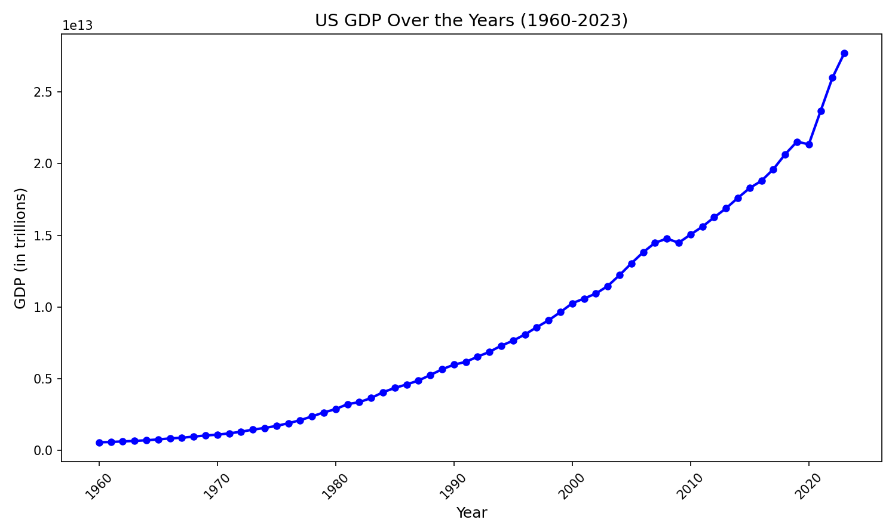
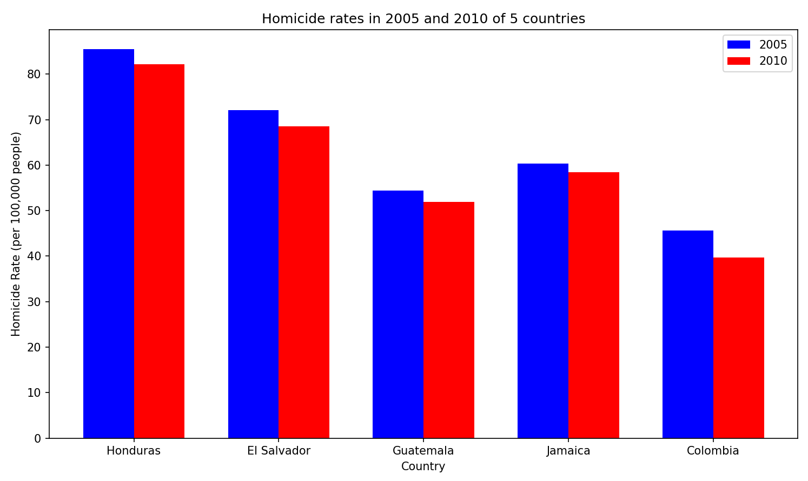

# Data Visualization Project

## United States GDP from (1960-2023)

This Line Chart shows the United States GDP from the years 1960 to 2023, it allows the reader to see how. The date used to make this graph can be found at this link: https://api.worldbank.org/v2/countries/USA/indicators/NY.GDP.MKTP.CD?per_page=5000&format=json

## Homicides in 5 countries

This Bar Graph shows the homicde rate per 100,000 people in the years 2005 and 2010 of 5 countries. I chose these countries because they were the 5 countries that had the highest homicide rates in both 2005 and 2010. The data used to make this graph can be found at this link: 

## Project Instructions
https://github.com/mikeizbicki/cmc-csci040/blob/2025spring/project_02_visualizing_datasets/README.md